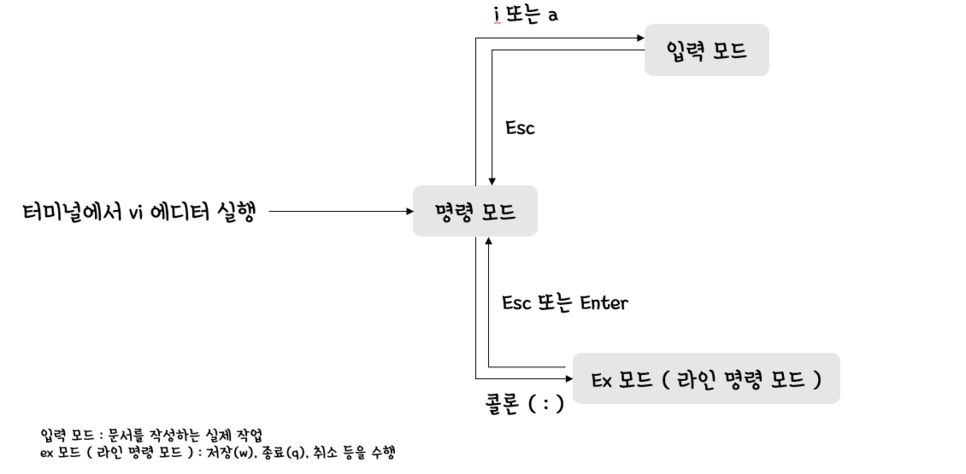

# 리눅스(Linux)

## 1. 리눅스(Linux)란?

리눅스(Linux)는 Windows, Mac OS와 같은 운영체제 중 하나이다. 리눅스에는 여러 배포판이 존재하고 있으며, 오늘은 그 리눅스의 배포판 중 하나인 Ubuntu를 사용해 볼 것이다.

## 2. 왜 리눅스(Linux)를 사용하는가?

리눅스(Linux)는 대표적인 오픈소스(open source) 운영체제이다. 즉, 이를 수정하여서 개인 또는 기업이 사용할 수 있다는 것이다. 따라서 보안성, 속도나 성능 등 필요한 기능을 개인에 맞춰 수정할 수 있기 때문에 자율성이 높다는 장점이 있다. IT 계열에서는 이 리눅스(Linux) 운영체제를 공부하고 사용하는 것이 필수적이라고 할 수 있다. STEM CAMP를 통해서 이 리눅스(Linux) 환경에서 여러가지 코드를 작성하고 파일을 다뤄볼 예정이니 후에 나오는 리눅스 명령어에 익숙해지도록 하자.

## 3. 리눅스(Linux) 명령어

### 리눅스 기본 명령어

| 명령어 | 기능 |
|--------|-----|
| sudo '명령어' | 관리자 권한으로 명령어 실행 |
| pwd | 현재 위치하는 디렉토리(폴더) |
| mkdir | 디렉토리(폴더) 생성 |
| rmdir / rm -r | 디렉토리(폴더) 삭제 |
| cd | 디렉토리(폴더) 이동 |
| ls | 현재 디렉토리(폴더) 내에 존재하는 파일 및 디렉토리(폴더)들을 표시 |
| cp | 파일 복사 |
| cp -r | 디렉토리(폴더) 내부까지 복사하기 위한 복사 옵션 |
| mv | 파일 이동 |
| rm | 파일 삭제 |
| chmod +x | 대상 파일의 실행 권한을 추가 |
| vi | vi 에디터로 파일 열기 |

### vi 에디터 명령어

vi 에디터 내부에서 사용할 수 있는 명령어로써, 처음 파일로 들어갔을 때 혹은 파일을 입력하는 도중 'esc' 키를 누른 뒤에 명령어를 입력할 수 있다.

| vi 에디터 명령어 | 기능 |
|-----------------|------|
| i | 현재 커서 위치에서 입력모드로 변경 |
| gg | 문서 맨 앞으로 이동 |
| G | 문서 맨 끝으로 이동 |
| 0 | 라인 맨 앞으로 이동 |
| $ | 라인 맨 뒤로 이동 |
| /'단어' | 문서에서 단어 찾기 |
|         | n이나 N으로 다음/이전 찾기 |
| dd | 현재 줄 잘라내기 |
| dw | 현재 단어 잘라내기 |
| yy | 현재 줄 복사하기 |
| p | 붙여넣기 |
| u | 되돌리기(Undo) |
| Ctrl + r | 다시하기(Redo) |
| :w | 문서 저장하기 |
| :q | 현재 문서 닫기 |
| :q! | 현재 문서 저장하지 않고 닫기 |
| :wq | 저장하고 닫기 |
| :se nu | 라인 숫자 표시하기 |
| :se nonu | 라인 숫자 표시 해제 |
| :'숫자' | 지정한 라인수로 이동 |

### 4. 리눅스(Linux) 명령어 연습해보기

리눅스(Linux) 명령어를 한번씩 사용해보고 익숙해지도록 연습하기

Vi 에디터를 이용하여서 파일을 만들고, vi 명령어를 사용해보기
