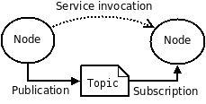
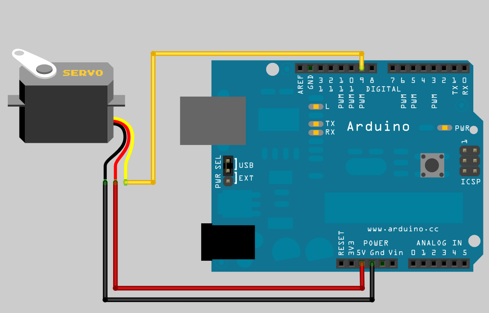
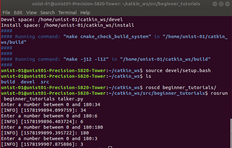

# ROS

## 1. ROS(Robot Operating System)란?

ROS(Robot Operating System)는 오픈 소스이며 로봇 소프트웨어를 개발하기 위한 메타 OS이다.
ROS는 로봇 안에 있는 다양한 엑츄에이터, 센서 등 여러 가지 요소들이 쓰는 다른 언어환경을 노드라는 것으로 통합하여서 노드간의 통신을 가능하게 해준다. 이를 통해서 각각의 요소간의 통신 규약(Protocol)을 생각하지 않고 작업을 할 수 있다. ROS는 미들웨어 소프트웨어지만 OS로 불린다.

## 2. 왜 ROS를 사용하는가?

노드 간 메세지 교환을 통해 통신하기 때문에 복잡한 프로그램을 잘게 나눠 공동 개발이 가능하다. 또한, 명령어 도구,시각화 도구(Rviz), GUI 도구 모음(rqt), 3차원 시뮬레이터(Gazebo)등 여러가지 도구를 지원한다.

    'Rviz' - 3D 시각화, 레이저, 카메라 등의 센서 데이터를 시각화, 로봇 외형과  계획된 동작을 표현
    'rqt' - Qt기반 프레임 워크 제공
    'Gazebo' - 물리 엔진을 탑재, 로봇 센서, 환경 모델 등을 지원, 3차원 시뮬레이터

로봇 프로그래밍에서 많이 사용되는 모델링, 센싱, 인식, 내비게이션, 조작(Manipulation) 기능을 제공한다.

## 3. Workspace 만들기

    $ mkdir -p ~/catkin_ws/src
    $ cd ~/catkin_ws
    $ catkin_make

catkin_make로 빌드가 완료되면, src 외에 build와 devel 폴더가 자동으로 생성된다.
build 폴더에는 catkin build의 빌드 관련 파일이 저장되고 devel 에는 빌드 후의 실행관련 파일이 저장된다.
src 폴더에는 빌드 관련 파일인 CMakelist.txt 가 생성된다.

## 4. Package 만들기

Package: ROS 를 구성하는 기본 단위. 패키지는 하나 이상의 노드를 포함하거나 다른 패키지의 노드를 실행하기 위한 설정 파일 등을 포함하고 있다.
src 폴더에서 tutorial package를 생성한다.

    $ cd src
    $ catkin_create_pkg beginner_tutorials std_msgs rospy roscpp

Catkin_ws 폴더로 다시 이동한 후 catkin_make를 실행한다.

    $ cd ..
    $ catkin_make
    $ echo "source ~/catkin_ws/devel/setup.bash" >> ~/.bashrc
    $ source ~/.bashrc

## 5. 노드(Node), 토픽(Topic)에 대한 이해 (Turtlesim)

노드(NODE) - 노드는 계산을 수행하는 프로세스다. 각각의 노드는 개별적인 작업을 수행하고 있고, 노드와 노드는 서로간의 메세지 통신을 통해서 데이터와 명령을 주고받는다.
토픽(TOPIC) - 노드에서 노드간에 주고 받는 메세지에 특정 주제를 발행(Publish)하여서 메세지를 발송할 수 있다. 이 특정 주제에 관심이 있는(주제와 관련된 메세지를 받아야 하는) 노드는 이 주제에 대한 구독(Subscribe)할 수 있다.  
메세지(Message) - 노드간에 주고 받는 데이터 형식이며, 특정 유형의 데이터 타입으로 구성된다.

### 완성된 프로그램의 노드, 토픽, 메세지

아래의 실습을 통해서 ROS에서의 통신을 이해해보자.

    $ sudo apt-get install ros-melodic-ros-tutorials
    $ roscore

새로운 터미널을 열고, 활성화된 노드 리스트를 보여준다.
Roscore를 실행해주었기 때문에, /rosout 노드를 확인할 수 있다.

    $ rosnode list

Turtlesim 패키지의 turtlesim node를 실행한다.

    $ rosrun turtlesim turtlesim_node

새로운 터미널을 연다.

    $ rosnode list

노드 리스트를 확인해보면, turtlesim 노드가 추가된 것을 볼 수 있다.
Turtle_teleop_key 노드를 실행시킨다.

    $rosrun turtlesim turtle_teleop_key

방향키를 누르면 거북이를 움직일 수 있다.
새로운 터미널을 열고 노드 리스트를 확인해보면 /teleop_turtle 노드가 추가된 것을 볼 수 있다.
현재 활성화된 노드와 주고받는 토픽을 확인할 수 있는 모식도가 그려진 창을 뜬다.

    $rqt_graph

/teleop_turtle 노드가 /turtle1/cmd_vel 이라는 토픽을 발행(Publish)하고, /turtlesim 노드가 이를 구독(Subscribe)하는 것을 볼 수 있다.

    $rostopic echo /turtle1/cmd_vel

/turtle1/cmd_vel 에서 전달되는 메시지를 확인할 수 있는데 어떤 방향키를 누르는지에 따라 주제(Topic)의 메시지가 바뀌는 것을 확인할 수 있다.

다시 rqt 창으로 돌아가 refresh버튼을 누르면 /turtle1/cmd_vel를 구독(subscribe)하는 노드가 하나 더 생긴 것을 확인할 수 있다. 이를 통해 토픽이 일대일 형식이 아니라 여러 노드 사이에서 전달될 수 있음을 확인할 수 있다.

## 6. 발행자(Publisher), 구독자(Subscriber) 노드 작성하기

### 발행자(Publisher) 만들기

연속적으로 메세지를 송출하는 발행자 노드(Publisher Node)인 "Talker"를 생성해 볼 것이다.
튜토리얼 패키지에 들어간다

    $ roscd beginner_tutorials

Scripts 폴더를 생성한다.

    $ mkdir scripts
    $ cd scripts

Talker.py 파일을 만든다.

    $ wget https://raw.github.com/ros/ros_tutorials/kinetic-devel/rospy_tutorials/001_talker_listener/talker.py

파일을 실행모드로 변경시킨 후, Vi 에디터로 코드를 확인해볼 수 있다.

    $ chmod +x talker.py
    $ vi talker.py

        1 #!/usr/bin/env python

파이썬 환경에서 실행한다는 의미로 모든 ROS 노드는 위 코드를 가장 위에 선언해 둔다.

01- line > 스크립트가 실행가능한지를 확인한다.

        2 import rospy
        3 from std_msgs.msg import String

02 - line > python으로 ROS 노드를 작성할 때는 rospy는 사용해야 한다.

03 - line > std_msgs/String 메세지 타입을 발행(Publish)할 수 있도록 한다.

        4 def talker():
        5     pub = rospy.Publisher('chatter', String, queue_size = 10)
        6     rospy.init_node('talker', anonymous = True)
        7     rate = rospy.Rate(10)

05 - line > String 메세지 타입을 사용하는 chatter 토픽에게 발행(Publish)한다는 것을 선언한다.

06 - line > rospy.init_node(NAME)은 rospy에게 노드의 이름을 알려주는 것이다. rospy가 이 정보를 얻기 전까지는 ROS Master와 통신이 시작되지 않는다. 'anonymous = True' 는 rospy.init_node()의 이름으로 사용되는 인수가 다른 이름과 겹치지 않고 유일해야 하는데 이를 해제시키는 역할을 한다. 즉, 복수의 talker.py 노드를 실행할 수 있게 만든다.

        8     while not rospy.is_shutdown():
        9           hello_str = "hello world %s" %rospy.get_time()
        10          rospy.loginfo(hello_str)
        11          pub.publish(hello_str)
        12          rate.sleep()

08 - line > rospy.is_shutdown()를 확인하면서 루프를 돌리게 된다. 즉, 사용자가 Ctrl + c를 눌러 작동을 멈추기 전까지는 계속 루프를 돌린다는 의미이다.

09 - line > 지정된 string 구문에 시간 정보를 붙여서 hello_str 이라는 변수에 저장한다.

10 - line > 이 코드는 세가지를 실행한다. 첫째, 화면에 프린트를 한다. 둘째, 노드의 로그 파일에 기록한다. 셋째, rosout에 기록한다. rosout에 기록된 내용으로 디버깅이 유용해진다.

11 - line > 이전에 선언된 pub에 hello_str 변수에 해당되는 텍스트를 발행(Publish)하게 된다.

12 - line > 지정된 시간만큼 딜레이시키는 역할을 한다.

        13 if __name__ == '__main__':
        14     try:
        15         talker()
        16     except rospy.ROSInterruptException: pass

standard python에 __main__ 체크 구문을 추가하는 내용으로 일치할 경우에만 talker()가 수행된다.

### 구독자(Subscriber) 만들기

연속으로 메세지를 구독(Subscribe)하는 구독자 노드(Subscriber Node)를 생성해 볼 것이다.

Listener.py 파일을 받는다.

    $ roscd beginner_tutorials/scripts/
    $ wget https://raw.github.com/ros/ros_tutorials/kinetic-devel/rospy_tutorials/001_talker_listener/listener.py

파일을 실행모드로 변경시킨 후, Vi 에디터로 코드를 확인한다.

    $ chmod +x listener.py

다음은 Listener.py의 코드이다.

          1 #!/usr/bin/env python
          2 import rospy
          3 from std_msgs.msg import String
          4 def callback(data):
          5     rospy.loginfo(rospy.get_caller_id() + "I heard %s", data.data)
          6 def listener():
          7     rospy.init_node('listener', anonymous=True)
          8     rospy.Subscriber("chatter", String, callback)
          9     rospy.spin()
          10 if __name__ == '__main__' : listener()

8 - line > 사용자의 노드가 std.msgs.msgs.String 의 형태의 타입의 메세지를 chatter 토픽으로부터 구독한다는 선언이다. 새로운 메세지를 수신했을 때, callback은 그 메세지를 첫번째 변수로 불러오게 된다.

9 - line > 사용자의 노드가 종료되기 전까지 python이 종료되는 것을 막는다.

Catkin_ws 폴더로 나가서 catkin_make를 실행한다.

      $ catkin_make
      $ source devel/setup.bash

Roscore를 실행한다.

      $ roscore

새 터미널에서 listener.py 를 실행한다.

      $ rosrun beginner_tutorials listener.py

새 터미널에서 talker.py 를 실행한다.

      $ rosrun beginner_tutorials talker.py

listener 노드가 talker 노드에서 발행(Publish)한 메세지를 구독(Subscribe)하여 출력한 것을 확인할 수 있다.

### 과제 - 아두이노를 ROS를 이용하여 서보모터를 돌려보자

터미널을 열고 아두이노를 설치한다. 아두이노 IDE를 실행시킨 후에 실행이 된다면 IDE 창은 종료시켜준다.

      $ sudo apt-get install arduino
      $ arduino

ROS workstation을 설치한다.

      $ sudo apt-get install ros-melodic-rosserial-arduino
      $ sudo apt-get install ros-melodic-rosserial
      $ cd sketchbook/libraries

/opt/ros/melodic/share/rosserial_arduino/make_libraries.py 내의 print 함수 문법을 python3 문법으로 수정해준다.
수정하기 전에 읽기 전용 권한을 쓰기 가능한 상태로 변경해줘야 한다.

      sudo chmod a+rwx /opt/ros/melodc/share/rosserial_arduino/make_libraries.py
      vi /opt/ros/melodc/share/rosserial_arduino/make_libraries.py

파일 안에서 내용을 수정해준다.

      line 74 : print(__usage__)
      line 81 : print("\nExporting to %s" % path)

다시 원래 커맨드 창으로 돌아와서 이후 명령어들을 입력해서 라이브러리를 실행해본다.

      $ rm -rf ros_lib
      $ rosrun rosserial_arduino make_libraries.py
      $ rosrun rosserial_arduino make_libraries.py ~/sketchbook/libraries

설치를 완료하고 아두이노와 서보모터를 그림과 같이 연결한다.

아두이노를 실행하기 전에 serial port 의 실행 권한을 변경해준다.
새 터미널을 연다.

      $ sudo chmod a+rwx /dev/ttyACM0

아두이노를 실행한다.

      $ arduino

[파일] -> [예제] -> [ros_lib] -> [ServoControl] 클릭
[도구] -> [시리얼포트] -> [/dev/tty/ACM0] 클릭

새 터미널에서 roscore를 실행한다.

      $ roscore

새 터미널에서 ros-serial을 실행한다.

      $ rosrun rosserial_python serial_node.py _port=/dev/ttyACM0

새 터미널을 연다.

      $ rostopic pub /servo std_msgs/UInt16 50 --once

50이라는 메세지를 /servo라는 노드에 발행(Publish)한다.

servo노드가 50이라는 메시지를 받으면 서보모터가 50도에 맞춰 돌아가게 된다.
0~180도의 각도를 임의로 설정하여 발행(Publish) 해보자.

이번에는 talker.py 를 수정하여 servo라는 토픽으로 각도 정보를 발행(Publish)해보자.

'Hint'

1. 정수로 된 메시지를 publish해야 하기 때문에 아래의 구문을 추가한다.

              import std_msgs.msg import UInt16

2. 각도를 입력 받기 위해 input 함수를 사용한다.

파일을 작성한 후, catkin_ws 폴더로 나가서 catkin_make를 실행한다.

      $ catkin_make
      $ source devel/setup.bash

새 터미널에서 roscore를 실행한다.

      $ roscore

다른 터미널을 열어서 ros 시리얼을 실행한다.

      $ rosrun rosserial_python serial_node.py _port:=.dev/ttyACM0

다른 터미널을 열어서 talker.py를 실행한다.

      $ rosrun beginner_tutorials talker.py

터미널 창에서 각도를 입력하면 서보모터가 움직인다.

결과 예시

