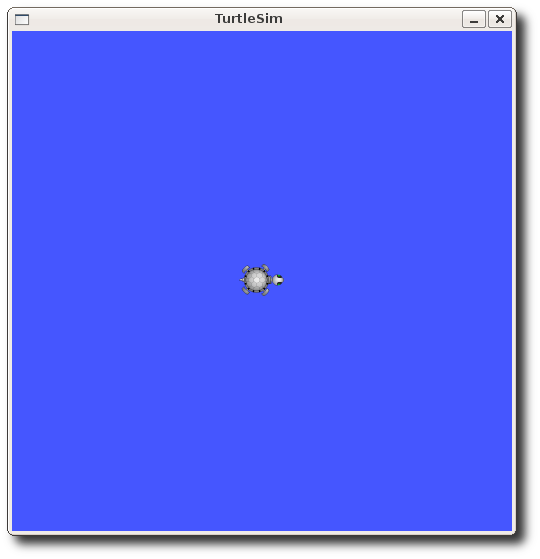

# ROS

## 1. ROS(Robot Operating System)란?

ROS(Robot Operating System)는 오픈 소스이며 로봇 소프트웨어를 개발하기 위한 메타 OS이다.

## 2. 왜 ROS를 사용하는가?

노드 간 메세지 교환을 통해 통신하기 때문에 복잡한 프로그램을 잘게 나눠 공동 개발이 가능하다. 또한, 명령어 도구,시각화 도구(Rviz), GUI 도구 모음(rqt), 3차원 시뮬레이터(Gazebo)등 여러가지 도구를 지원한다.

    'Rviz' - 3D 시각화, 레이저, 카메라 등의 센서 데이터를 시각화, 로봇 외형과  계획된 동작을 표현
    'rqt' - Qt기반 프레임 워크 제공
    'Gazebo' - 물리 엔진을 탑재, 로봇 센서, 환경 모델 등을 지원, 3차원 시뮬레이터

로봇 프로그래밍에서 많이 사용되는 모델링, 센싱, 인식, 내비게이션, 조작(Manipulation) 기능을 제공한다.

## 3. Workspace 만들기

    $ mkdir -p ~/catkin_ws/src
    $ cd ~/catkin_ws
    $ catkin_make

catkin_make로 빌드가 완료되면, src 외에 build와 devel 폴더가 자동으로 생성된다.
build 폴더에는 catkin build의 빌드 관련 파일이 저장되고 devel 에는 빌드 후의 실행관련 파일이 저장된다.
src 폴더에는 빌드 관련 파일인 CMakelist.txt 가 생성된다.

## 4. Package 만들기

Package: ROS 를 구성하는 기본 단위. 패키지는 하나 이상의 노드를 포함하거나 다른 패키지의 노드를 실행하기 위한 설정 파일 등을 포함하고 있다.
src 폴더에서 tutorial package를 생성한다.

    $ cd src
    $ catkin_create_pkg beginner_tutorials std_msgs rospy roscpp

Catkin_ws 폴더로 다시 이동한 후 catkin_make를 실행한다.

    $ cd ..
    $ catkin_make
    $ source devel/setup.bash

## 5. 노드(Node), 토픽(Topic)에 대한 이해 (Turtlesim)

노드(NODE) - 노드는 계산을 수행하는 프로세스다. 각각의 노드는 개별적인 작업을 수행하고 있고, 노드와 노드는 서로간의 메세지 통신을 통해서 데이터와 명령을 주고받는다.
토픽(TOPIC) - 노드에서 노드간에 주고 받는 메세지에 특정 주제를 게시(Publish)하여서 메세지를 발송할 수 있다. 이 특정 주제에 관심이 있는(주제와 관련된 메세지를 받아야 하는) 노드는 이 주제에 대한 구독(Subscribe)할 수 있다.  
메세지(Message) - 노드간에 주고 받는 데이터 형식이며, 특정 유형의 데이터 타입으로 구성된다.

아래의 실습을 통해서 ROS에서의 통신을 이해해보자.

    $ sudo apt-get install ros-melodic-ros-tutorials
    $ roscore

새로운 터미널을 열고, 활성화된 노드 리스트를 보여준다.
Roscore를 실행해주었기 때문에, /rosout 노드를 확인할 수 있다.

    $ rosnode list

Turtlesim 패키지의 turtlesim node를 실행한다.

    $ rosrun turtlesim turtlesim_node

새로운 터미널을 연다.

    $ rosnode list

노드 리스트를 확인해보면, turtlesim 노드가 추가된 것을 볼 수 있다.
Turtle_teleop_key 노드를 실행시킨다.

    $rosrun turtlesim turtle_teleop_key

방향키를 누르면 거북이를 움직일 수 있다.
새로운 터미널을 열고 노드 리스트를 확인해보면 /teleop_turtle 노드가 추가된 것을 볼 수 있다.
현재 활성화된 노드와 주고받는 토픽을 확인할 수 있는 모식도가 그려진 창을 뜬다.

    $rqt_graph

/teleop_turtle 노드가 /turtle1/cmd_vel 이라는 토픽을 게시(Publish)하고, /turtlesim 노드가 이를 구독(Subscribe)하는 것을 볼 수 있다.

    $rostopic echo /turtle1/cmd_vel

/turtle1/cmd_vel 에서 전달되는 메시지를 확인할 수 있는데 어떤 방향키를 누르는지에 따라 주제(Topic)의 메시지가 바뀌는 것을 확인할 수 있다.

다시 rqt 창으로 돌아가 refresh버튼을 누르면 /turtle1/cmd_vel를 구독(subscribe)하는 노드가 하나 더 생긴 것을 확인할 수 있다. 이를 통해 토픽이 일대일 형식이 아니라 여러 노드 사이에서 전달될 수 있음을 확인할 수 있다.
