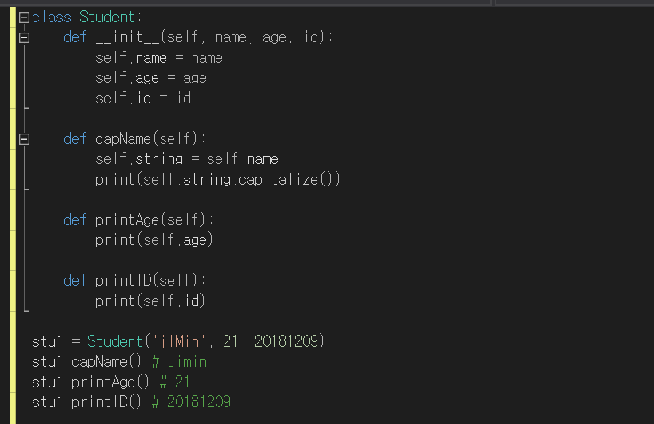

# 파이썬(PYTHON)

지금까지 우리가 배운 파이썬 문법을 바탕으로, 이번 랩에서는 ‘클래스’ 라는 개념을 배워보려고 한다. 먼저 ‘클래스’ 하면 무엇이 떠오르는가? 컴퓨터 언어에서 클래스 라는 단어는 ‘그룹’, ‘묶음’을 뜻한다. 여러 개의 클래스가 존재한다는 것은 여러 개의 그룹들이 존재한다는 말과 같다. 프로그래머의 관점에서 조금 더 구체적으로 클래스가 무엇인지 알아보도록 하자.

## '클래스(Class)'는 객체를 생성하는 '틀'이다.

클래스란 유사한 성질을 가진 객체들을 생성하기 위해 ‘속성’과 ‘메소드’ 를 정의하는 일종의 틀이다. ‘객체’는 클래스의 구성원으로, 하나의 클래스는 여러 개의 객체를 가질 수 있다. 속성과 메소드는 클래스의 객체가 어떻게 동작할지를 결정하는 일종의 함수이다. 객체들은 클래스라는 틀에 의해 붕어빵처럼 찍어서 만들어져 나오며, 공통된 속성과 메소드를 갖게 된다.

예를 들어, ‘학생’ 이라는 클래스 내부에는 학생의 이름, 학생의 나이, 학생의 출석번호를 기술할 수 있는 속성과 메소드가 포함되며 ‘임가은’, ‘이현빈’, ‘김태윤’, ‘임수철’ 과 같은 학생 객체들을 찍어낼 수 있게 된다.

## 간단한 예제로 클래스 이해하기

다음에 주어진 클래스의 이름을 참고하여 클래스에 포함될 수 있는 속성과 메소드(함수) 3개를 생각하여 적어보고, 찍어낼 수 있는 3가지 객체를 적어보아라.

|클래스 이름| 함수 | 객체|
|----------|------|-----|
|무기|공격력,무게,사정거리|화살, 대포, 기관총|
|휴대폰|       |         |
|자동차|       |         |

## RACECAR와 클래스

앞으로 우리가 만들게 될 레이스카는 Basic Motion, Line Following, Potential Field 등 다양한 기능을 포함한다. 이때 클래스를 사용하는 이유는 각각의 기능들을 구체적으로 구현할 함수를 그룹화해야하기 때문이다. 예를 들어, Basic_Motion클래스에는 Go_Forward, Go_Backward, Up_Speed와 같은 함수들을 포함시킬 수 있다.

## 실습하기
이제 우리가 배운 내용을 바탕으로 간단한 클래스를 직접 구현해보려고 한다. ‘Jupyter Notebook’은 짧은 코드를 실행하고 결과를 확인하기에 좋으므로 우리는 이것을 이용하려고 한다. 아래 링크를 통해 실습 파일을 다운로드 받으면 된다.

'<https://drive.google.com/drive/folders/13o4w20s6C3KVyEfNNbzsOLnCQxPA1ljW>'
