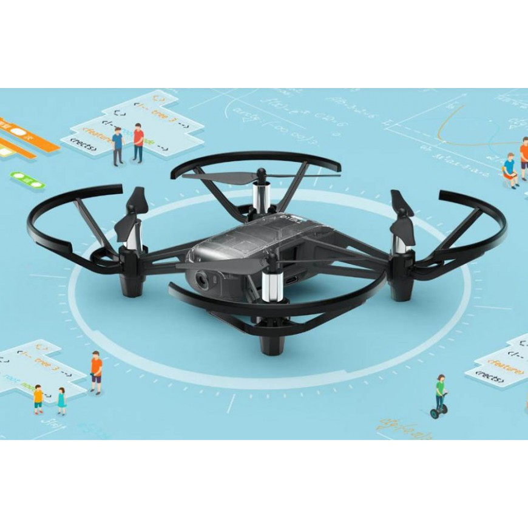
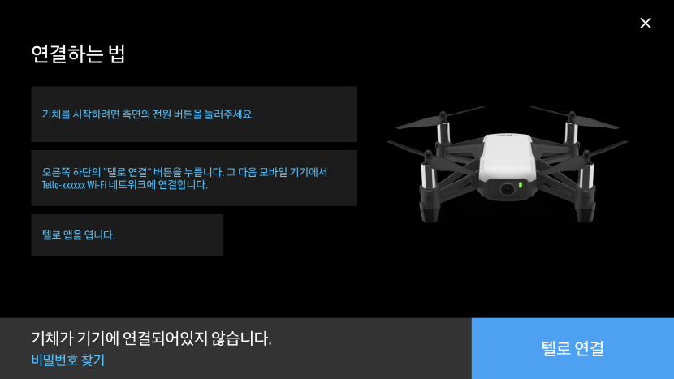
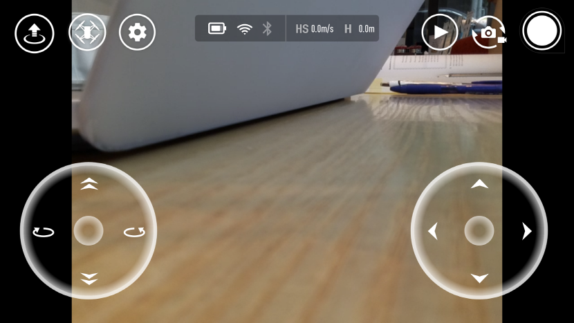

# TELLO란 무엇인가?

RYZE 사에서 만든 미니드론으로 핸드폰 어플리케이션과 연동시켜서 사용할 수 있고, 카메라를 통한 사진과 영상 촬영 기능과 다양한 조작 기능을 제공하고 있다.

이번 STEM-CAMP에서 사용하는 기종은 TELLO-EDU 이며, 기존 TELLO보다 교육에 초점을 맞춘 프로그래밍 교육용 드론이다. 직접 Python, Scratch, Swift와 같은 프로그래밍 언어를 사용하여 조작해볼 수 있으며, 본 프로그램에서는 Python을 이용한 TELLO-EDU의 조작을 배워 볼 예정이다.

# TELLO 조작방법

## 어플리케이션을 이용한 조작

      Android  https://play.google.com/store/apps/details?id=com.ryzerobotics.tello_
      Apple  https://apps.apple.com/kr/app/tello/id1330559633_

1.	모바일 장치에서 WIFI 기능을 활성화시킨 후, TELLO-xxxxxx 네트워크를 선택한다.

  __“주의”__ 네트워크 연결 시 다른 기기와 연결되어서 드론이 비행하여 다칠 수 있으므로 각 팀별 TELLO의 고유번호를 잘 파악하여서 연결해야 한다.

2.  텔로 어플리케이션을 실행하고 텔로를 활성화시킨다.

3.	텔로를 자유롭게 조작한다.

  __“주의”__ 드론끼리의 충돌, 드론 날개의 직접적인 충돌로 부상이 생길 수 있으니 충분한 공간을 확보한 뒤에 드론을 비행하고 조작해보도록 한다.

## 파이썬 코드를 이용한 조작

1.	WSL – Ubuntu 18.04 – LTS를 실행한다.
2.	Dronblocks-Tello-Python 폴더를 참조하여 조작을 실행해본다.

네트워크 연결 메시지 드론에 보내기

드론과 노트북을 연결해서 키보드로 드론을 조작해보기

###참고 – 드론 명령어

|명령어|설명|출력 예상 문구|
|-----|----|-------------|
|-command|TELLO 명령어 모드|	ok / error|
|-takeoff|			TELLO 이륙		|ok / error|
|-Land		|	TELLO 착륙	|	ok / error|
|-emergency	|	비상정지	|	ok / error|
|-up x	|		xcm 상승 (x: 20-500)	|ok / error|
|-down x |			xcm 하강 (x: 20-500)	|ok / error|
|-left x		|	xcm 왼쪽으로 비행|	ok / error|
|-right x 	|		xcm 오른쪽으로 비행|	ok / error|
|-forward x	|	xcm 전진	|	ok / error|
|-back x		|	xcm 후진	|	ok / error|
|-cw x		|	시계방향으로 x도 회전|	ok / error|
|				|(x: 1 – 3600)| |
|-ccw x		|	반시계방향으로 x도 회전|	ok / error|
|-flip x		|	x 방향으로 회전	|	ok / error|
|			|	(x : 4방향)| |
|-speed x		|	초속 xcm로 스피드설정|	ok / error|
|-speed?		|	현재 속도 출력	|	x: 1-100|
|-battery?	|		배터리 잔량 출력|	x: 0-100|
|-time?		|	비행시간 출력	|	시간(time)|
|-height?	|		높이 출력	|	x: 0-3000|
