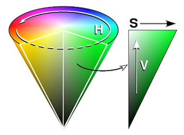

# Color Segmentation and oepnCV

 색 공간은 일반적으로 이미지를 인코딩하는 데 사용되는 색의 조직이다. 대부분의 사람들이 들어본 가장 흔한 색 공간은 RGB 색 공간이다. 
 
 다른 것들은 CMYK와 YIQ 모델을 포함하지만, 로봇 공학을 위한 일반적인 색 공간은 HSV 색 공간이다.

 HSV는 색상(Hue), 채도(Saturation), 그리고 명도(Value)를 의미한다. 위에서 언급했듯이 통상적으로 로봇공학에는 HSV필터가 많이 쓰이기 때문에 이번 Lab에서도 마찬가지로 사용할 예정이다.

 다음 사진은, HSV의 분포를 나타내는 모형이다. 
 
 

 어떤 특정 색의 HSV 값을 알고 싶다면, 인터넷에 검색하면 나온다.

## Goal:
 1. 사용하게 될 HSV 필터의 개념을 정확히 이해한다.
 2. 주황색깔 테이프를 인식할 수 있도록 하는 코드를 작성한다.

## Part 0: Setup

 `이 링크`에서 필요한 파일을 다운로드할 수 있다. 주로 `slider_colorsegmentation.py`, `driveNode.py`와 함께 작업하게 될 것이다.
 자동차에 있는 `Jetson Nano`에서 다음 코드가 잘 작동되는지 확인해보자.
    
    python 
    import cv2 
    cv2.__version__

 위의 파일을 `raccar_ws/src` 내의 스크립트 폴더에 넣으십시오.

## part 1 : HSV필터를 이용해서 색을 정확히 인식하자
 우선 `slider_colorsegmentation.py` 를 실행하면, 총 두개의 창이 뜨게 된다.
 하나는 HSV 필터 설정을 할 수 있는 창이고, 다른 하나는 HSV 필터가 적용되어 카메라의 현재 촬영중인 이미지를 흑백으로 표현하는 창이다.  
 
 위에서 설명했던 HSV필터가 적용되면 특정 색상, 채도, 명도 범위에 포함되는 색만을 흰색으로 표현 해준다. 반대로, 포함되지 않는 색은 검은색으로 표현된다.

 `slider_colorsegmentation.py` 를 실행하면, HSV 필터를 설정할 수 있는 창이 뜨게 된다. 
 각각의 색상, 채도, 명도의 low와 high를 이용해 제공된 주황색 테이프를 잘 인식할 수 있도록 설정해라. (설정된 HSV 필터는 테이프의 영역만을 흰색으로 표현해야 한다.) 
 

## part 2 : Color Segmentation을 이용한 개체 감지(detection) 
 여러분이 Part1에서 구한 HSV필터의 설정값은 이제 자동차가 주황색 선로만 따라 움직일 수 있도록 하는 기본 설정값 중 하나이다.

 `color_segmentation`에 들어가면 주석으로 `To do` 라고 작성되어 있는 부분이 있다. 

 

  아래 코드는 임의의 색을 인식할 수 있도록 하는 HSV 필터 설정이다. 아래 코드를 참고하여 여러분들이 part1에서 구했던 HSV필터 설정을 적용해보자.
  
     law_range = np.array( [x1, y1, z1] )
     high_range = np.array( [x2, y2, z2] )

 `color_segmentation` 을 잘 작성했는지 확인해 보기 위해서는 해당 파일을 저장하고 난 뒤, `teleop`을 실행해보자.
 실행하게 되면, 카메라에 어떤 물체들이 인식되는지 박스로 표현될 것이다. 이때 박스가 주황색 테이프를 잘 인식하는지, 테이프 뿐만이 아니라 다른 주황색들도 인식하는지 확인해보면 좋을 것 같다.
 
 자동차를 보면 카메라가 자동차 가장 앞쪽에 부착되어 있다. 
 카메라는 다음 사진과 같이 바닥에 붙어있는 주황색 선만을 인식하며 자동차가 그 선을 따라갈 수 있도록 프로그래밍 되어야 한다. 

 

 정리하자면, 바닥에 주황색과 비슷한 색의 스티커가 부착되어 있다 하더라도 무시하고 달릴 수 있어야 한다는 것이다. 

 part2에서 가장 중요한 것은 오직 테이프의 색상만을 인식하는지 확인하는 것이 중요하다. 인식 범위가 너무 넓다면, 다른 색들도 카메라가 인식하게 될 것이고, 인식 범위가 너무 좁다면 필요한 색상을 인식하지 못할 것이다. 
 적당한 범위로 HSV를 설정하는 것이 무엇보다 중요하다.
 
