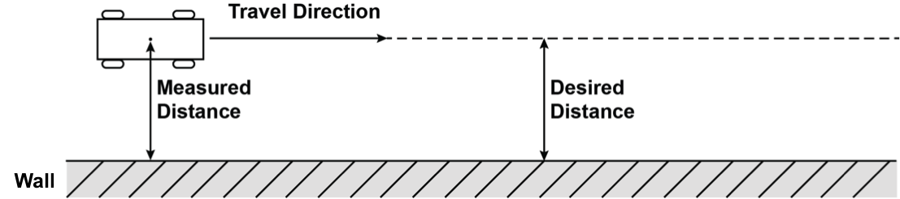
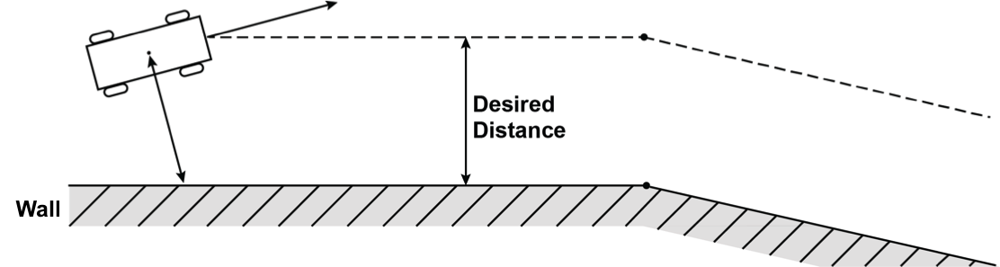
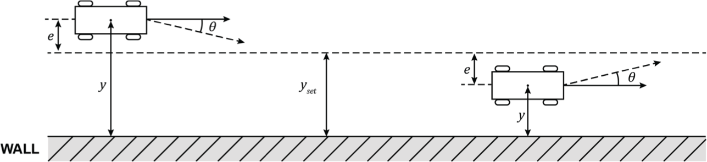
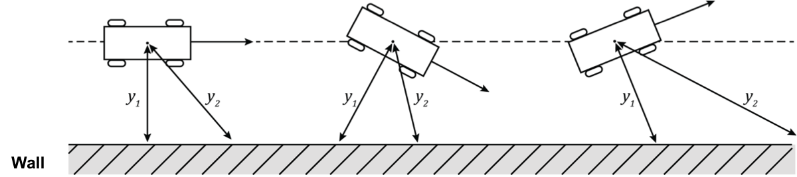
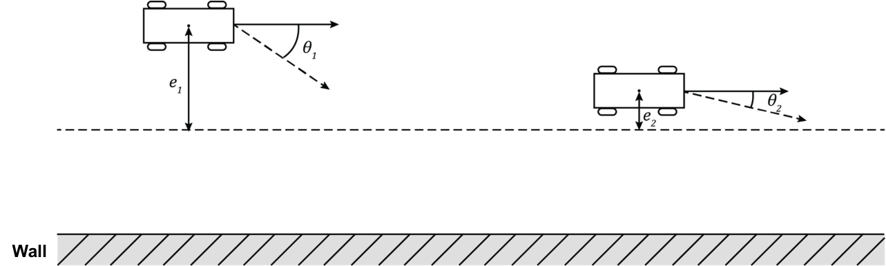
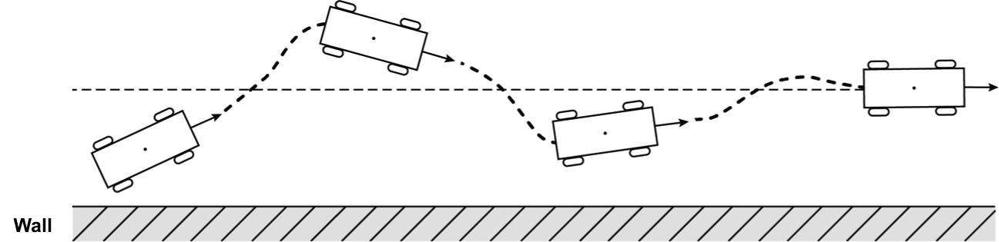
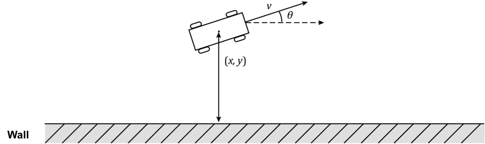

# Path Planning

## Followers

Follower는 로봇이 앞으로 나아가면서 오차 범위를 작게 유지하는 제어법이다.

예를 들어서 Wall Following 로봇은 측면 센서를 사용하여 벽까지의 거리를 측정하고, 그 거리를 고정 된 상태로 유지하면서 앞으로 이동할 수 있다.

앞으로 가는 것은 쉽지만, 어떻게 벽과의 거리를 일정하게 유지할까? 벽의 모양이 바뀐다거나 벽과 일정 각도로 기울어진 상태에서 출발했다거나 센서 값에 잡음이 끼거나 불확실하다면 어떻게 해야 할까?

## 1. 뱅뱅 컨트롤러(Bang-Bang Controller)

### 기본 뱅뱅 컨트롤러

뱅뱅 컨트롤러(Bang-Bang Contoller)는 매우 간단한 컨트롤러 모델로, 일정한 동작으로 오차를 줄이는 방향으로 되돌아가는 동작을 수행합니다. 우리가 벽과 유지하려는 거리를 yset라고 정의해보자. 만약 실제 측정된 벽과의 거리가 y라고 한다면, 오차인 e = y - yset이다.

뱅뱅 컨트롤러의 규칙은 다음과 같다.
* 만약 e > 0 인 경우 : 벽 방향으로 θ만큼 회전한다.
* 만약 e < 0 인 경우 : 벽 반대방향으로 θ만큼 회전한다.

### 두 점을 이용한 뱅뱅 컨트롤러

뱅뱅 컨트롤러를 두 점을 이용해서 변형한 형태이다. 두 점을 이용한 뱅뱅 컨트롤러의 규칙은 다음과 같다.

* 만약 e1 > 0 and e2 > 0 인 경우 : 벽 방향으로  θ1 만큼 회전
* 만약 e1 > 0 and e2 < 0 인 경우 : 벽 반대방향으로  θ2 < θ1 만큼 회전
* 만약 e1 < 0 and e2 > 0 인 경우 : 벽 방향으로  θ2 만큼 회전
* 만약 e1 < 0 and e2 < 0 인 경우 : 벽 반대방향으로  θ1 만큼 회전

## 2. 비례 미분 제어(PD Controller) - 참고자료

### 비례 제어 (Proportional Controller)

뱅뱅 컨트롤러는 일정한 동작으로 오차를 줄이는 방향으로 작동하지만, 비례 미분 제어는 오차에 '비례해서' 오차를 줄이는 방향으로 작동한다.

<math xmlns="http://www.w3.org/1998/Math/MathML" display="block">
  <mi>u</mi>
  <mo>=</mo>
  <mo>&#x2212;<!-- − --></mo>
  <msub>
    <mi>k</mi>
    <mi>P</mi>
  </msub>
  <mi>e</mi>
</math>
  
이는 시스템이 기하급수적으로 목표 설정 점으로 수렴하는 것을 돕는다.

컨트롤러 상수 kp는 시스템이 오차에 얼마나 빨리 응답하는지를 결정한다.

### 미분 제어 (Derivative Controller)

진동과 오버슛(Overshoot)을 방지하기 위해서 비례 제어기를 추가할 수 있다. 미분 제어는 오차의 미분값에 비례하는 동작으로 반작용한다. 이를 댐핑 마찰력이라고 부른다.

<math xmlns="http://www.w3.org/1998/Math/MathML" display="block">
  <mi>u</mi>
  <mo>=</mo>
  <mo>&#x2212;<!-- − --></mo>
  <msub>
    <mi>k</mi>
    <mi>P</mi>
  </msub>
  <mi>e</mi>
  <mo>&#x2212;<!-- − --></mo>
  <msub>
    <mi>k</mi>
    <mi>D</mi>
  </msub>
  <mrow class="MJX-TeXAtom-ORD">
    <mover>
      <mi>e</mi>
      <mo>&#x02D9;<!-- ˙ --></mo>
    </mover>
  </mrow>
</math>
  

### 비례 제어 Wall Follower

 (x , y) 에 위치한 로봇이  (q) 으로 향하고 있다. 로봇이 움직이고 있는 속도는  v 이고, 속도의 미분값들은 다음과 같다.

<math xmlns="http://www.w3.org/1998/Math/MathML" display="block">
  <mi>u</mi>
  <mo>=</mo>
  <mo>&#x2212;<!-- − --></mo>
  <msub>
    <mi>k</mi>
    <mi>P</mi>
  </msub>
  <mi>e</mi>
</math>
  
<math xmlns="http://www.w3.org/1998/Math/MathML" display="block">
  <mrow class="MJX-TeXAtom-ORD">
    <mover>
      <mi>y</mi>
      <mo>&#x02D9;<!-- ˙ --></mo>
    </mover>
  </mrow>
  <mo>=</mo>
  <mi>v</mi>
  <mi>s</mi>
  <mi>i</mi>
  <mi>n</mi>
  <mo stretchy="false">(</mo>
  <mi>&#x03B8;<!-- θ --></mi>
  <mo stretchy="false">)</mo>
</math>
  
<math xmlns="http://www.w3.org/1998/Math/MathML" display="block">
  <mrow class="MJX-TeXAtom-ORD">
    <mover>
      <mi>&#x03B8;<!-- θ --></mi>
      <mo>&#x02D9;<!-- ˙ --></mo>
    </mover>
  </mrow>
  <mo>=</mo>
  <mi>&#x03C9;<!-- ω --></mi>
</math>
  

벽과의 거리에 따른 오차와 그것의 미분값 또한 다음과 같이 정의될 수 있다.

<math xmlns="http://www.w3.org/1998/Math/MathML" display="block">
  <mi>e</mi>
  <mo>=</mo>
  <mi>y</mi>
  <mo>&#x2212;<!-- − --></mo>
  <msub>
    <mi>y</mi>
    <mrow class="MJX-TeXAtom-ORD">
      <mi>s</mi>
      <mi>e</mi>
      <mi>t</mi>
    </mrow>
  </msub>
</math>
  
<math xmlns="http://www.w3.org/1998/Math/MathML" display="block">
  <mrow class="MJX-TeXAtom-ORD">
    <mover>
      <mi>e</mi>
      <mo>&#x02D9;<!-- ˙ --></mo>
    </mover>
  </mrow>
  <mo>=</mo>
  <mrow class="MJX-TeXAtom-ORD">
    <mover>
      <mi>y</mi>
      <mo>&#x02D9;<!-- ˙ --></mo>
    </mover>
  </mrow>
</math>
  
<math xmlns="http://www.w3.org/1998/Math/MathML" display="block">
  <mrow class="MJX-TeXAtom-ORD">
    <mover>
      <mi>e</mi>
      <mo>&#x00A8;<!-- ¨ --></mo>
    </mover>
  </mrow>
  <mo>=</mo>
  <mrow class="MJX-TeXAtom-ORD">
    <mover>
      <mi>y</mi>
      <mo>&#x00A8;<!-- ¨ --></mo>
    </mover>
  </mrow>
</math>
  

## 3. Wall Follower - CHALLENGE!

### Challenge 안내

지금부터 Wall Following을 이용한 레이스 도로 주행을 연습해 볼 것이다.

### 기본 알고리즘

Wall Following은 자동차가 벽을 따라 주행하는 매우 간단한 자율주행법 방식이다. Wall Following을 구현하는 방법은 여러 가지가 있다. 가장 간단한 방법은 장애물과 자동차 측면까지 일정한 거리를 유지하는 방법이다(비례 제어 혹은 PID 제어 사용).

또 다른 방법 중에 하나는 벽일 가능성이 가장 높은 것을 찾아낸 다음, 벽의 경로를 예측하는 것이다. 완전 선형 회귀 분석을 시도해 볼 수 있지만, 가장 효율적인 방법은 아니라고 볼 수 있다. 그 외에도 'Lab05 - 01'에서 설명했었던 뱅뱅 제어(Bang-Bang Controller)를 사용하여서 벽을 상징하는 듯한 두 개의 무작위 근접점을 고른 뒤에, 차를 그들을 통과하는 선에 따르도록 할 수도 있다.

