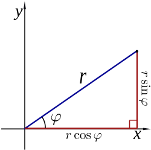

# 포텐셜 필드 (Potential Field)

## 포텐셜 필드의 작동방법

Wall Following과는 다르게 포텐셜 필드(Potential Field)는 주변의 모든 LIDAR 데이터를 사용하여 어떻게 이동해야 할 지를 결정합니다. 이 방법을 통해 주변에 벽의 존재 여부와 관계 없이 어떤 공간에서도 자유롭게 자율 주행을 적용할 수 있음을 의미한다.

모든 LIDAR 데이터는 자동차에서부터 일정 점까지를 가리키는 벡터값이라고 생각해보자. 자동차가 이 장애물을 피하기 위해서, 자동차가 이 벡터값을 반대 방향으로 고려하여서, 장애물로부터 멀어지게 만들려고 한다. 그래서 1미터 앞에 장애물이 존재한다면, 자동차는 이것을 반대 방향으로 1미터 길이의 벡터로 해석하는 것이다. 실제로, 자동차는 모든 방향(0~360도)에서 데이터를 얻을 것이다. 이제 이 모든 벡터들을 합쳐서 자동차가 어떤 방향으로 움직여야 하는지, 그리고 얼마나 빨리 가야 하는지를 알려주는 최종 벡터를 만들 수 있을 것이다.

위 그림에서 유인력(목표점)도 있지만 반발력(장애물)만 사용한다. 이를 맞추기 위해서 기본 속도와 방향을 설정할 수 있다.

속도를 정하기 위해서는, 장애물로 측정된 점이 얼마나 떨어져 있는지를 조정할 수 있는 방법이 필요하지만, 비례 제어와는 상반되는 효과를 얻어야 한다. 만약, 장애물이 자동차와 가까이 존재한다면, 이 장애물을 우선순위에 놓음으로써, 당장 주행에는 필요하지 않은 멀리 있는 장애물들을 고려하지 않는 것이다. 그림을 통해서 장애물에 가까운 벡터가 가장 크다는 것 또한 확인할 수 있을 것이다.

이를 통해 최종적인 벡터합은 아래와 같이 확인해 볼 수 있다.

이렇게 여러분이 직접 더 짧은 장애물과의 거리가 훨씬 빠른 속도값을 생성해내고, 더 먼 장애물과의 거리가 상대적으로는 느린 속도값을 생성할 구 있도록, 수집되는 데이터 값들을 특정 요소로 적용할 수 있을 것이다. 또한 적절하게 자동차의 동력을 공급할 수 있을 정도의 값을 얻기 위한 상수곱이 필요할 수도 있다.

이 포텐셜 필드를 통해서 얻을 수 있는 최종 벡터의 형태는 [속도, 각도] 형식의 2차원 극 좌표계 형식이다. 원하는 경우 이를 데카르트 직교 좌표계의 형태로 변형해 볼 수도 있을 것이다.

## 참고 극 좌표계를 데카르트 직교 좌표계로 변환하기

### 극 좌표계 (r,θ) 데카르트 좌표계 (x,y)로의 변환법

* x = r × cos( φ )
* y = r × sin( φ )
