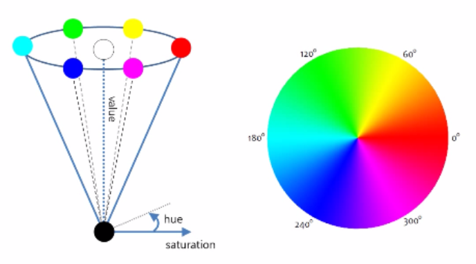

# OpenCV를 활용한 색 분할(Color Segmentation)

## 색 공간

 색 공간은 일반적으로 이미지를 인코딩하는 데 사용되는 색의 조직이다.

 일반적으로 쓰이는 가장 흔한 색 공간은 <b>RGB(Red Green Blue)</b> 색 공간이다.

 <b>RGB</b>를 이용한 색상의 표시는 다음과 같을 수 있다.

 | <b>색깔</b>  |  <b>RGB 값</b>   |
 |--------------|-----------------|
 |    빨강색    |     255,0,0      |
 |    주황색    |     255,128,0    |
 |    분홍색    |     255,153,255  |

그 외에도 다양한 색 공간 모델들이 존재하는데, 인쇄물에서 주로 사용되는 <b>CMYK</b> 이 대표적인 다른 예이다.

이번 과정에서 우리가 주로 사용할 색 공간 모델은 <b>HSV</b>이다.

HSV는 색상(<b>H</b>ue), 채도(<b>S</b>aturation), 그리고 명도(<b>V</b>alue)를 의미한다.

로봇공학에는 통상적으로 HSV 모델을 많이 사용한다.

다음 사진은, HSV의 분포를 나타내는 모형이다.

 

## OpenCV

<b>OpenCV</b>(Open Source Computer Vision)은 실시간 컴퓨터 비전을 목적으로 한 프로그래밍 라이브러리로 이미지 처리 과정에서 많이 사용되는 라이브러리이다.

이번 과정에서 주로 사용할 OpenCV - Python은 파이썬 API로 OpenCV의 C++ API를 파이썬 언어로 랩핑하여
파이썬 언어로 사용할 수 있도록 만든 것이다.

파이썬 API에서 사용하기 위해서 프로그램에서 `cv2` 모듈을 이용하면 가능하다.

이 OPenCV는 보통 다차원 배열을 쉽게 처리할 수 있도록 도와주는`numpy` 모듈과 같이 사용한다.

      >>> import cv2
      >>> import numpy

### 이미지 불러오기

이미지를 불러오기 위해서는 `cv2.imread()` 함수를 이용하여 이미지 파일을 읽는다.

      >>> cv2.imread(fileName, flag)

이미지 파일의 경로를 fileName을 통해서 받아들이며, flag 값에 따라서 출력되는 이미지 종류가 정해진다.

* `cv2.IMREAD_COLOR` : 이미지 파일을 Color로 읽는다.
* `cv2.IMREAD_GRAYSCALE` : 이미지 파일을 GrayScale로 읽는 flag로 처리단계에서 많이 사용합니다.

파일의 반환 형태는 numpy.ndarray 형태로 반환되며, 3차원 행렬형태이다.

      >>> import cv2
      >>> img = cv2.imread('STEM.jpg', cv2.IMREAD_COLOR)

img는 numpy.ndarray의 정확한 형태를 알고 싶다면 다음 명령어를 통해서 확인할 수 있다.

`img.shape`를 통해서 (행, 열, 채널) 값을 확인할 수 있다.

      >>> img.shape
      (206, 207, 3)

NOTE
    IMREAD_GRAYSCALE 로 출력한 경우에는 행과 열 값만 확인할 수 있다.

img의 전체 pixel 수의 확인은 `img.size`로 확인할 수 있습니다.

      >>> img.size
      42642

### 이미지 화면에 띄우기

이미지를 화면에 띄우기 위해서는 `cv.imshow()` 함수를 이용하여 사이즈에 맞게 보여준다.

      >>> cv2.imshow(title, image)

title은 이미지를 띄우는 창의 이름이며 imgae는 numpy.ndarray 형태의 파일을 받는다.

* `cv2.waitKey()` : keyboard 입력을 대기하는 함수로, 0이면 무한대기이고, 나머지 숫자는 milisecond 단위이다.
* `cv2.destroyAllWindows()` : 화면에 나타난 윈도우를 종료합니다.

다음의 코드는 이미지 파일을 읽어와서 화면에 출력하는 코드이다.

      >>> import cv2
      >>> img = cv2.imread('STEM.jpg', cv2.IMREAD_COLOR)
      >>> cv2.imshow('Original', img)
      >>> cv2.waitKey(0)
      >>> cv2.destroyAllWindows()

### 픽셀 값 출력하기

위에서 봤듯이 이미지는 numpy.ndarray 형태의 파일로 존재하고 있고, 각각의 픽셀 값에 접근해 볼 수 있다.
각 3차원 정보는 (행, 열, 색정보) 형태로 저장되어 있다.

      >>> import cv2
      >>> import numpy as np

      >>> img = cv2.imread('STEM.jpg', cv2.IMREAD_COLOR)
      >>> pixel = img[100,200]
      >>> print px
      [100, 200, 50]

위 코드를 통해서 우리는 100(행), 200(열) 색 값이 100(B), 200(G), 50(R) 인 것을 알 수 있다.
OpenCV가 제공하는 색 값은 BGR로 RGB와 순서가 다르기 때문에 헷갈리지 않도록 주의해야 한다.

개별 값만을 확인해보고 싶다면 다음과 같이 코드를 적을 수 있다.

      >>> pixel_blue_value = img[100, 200, 1]
      >>> pixel_blue_value
      100

이미지를 조작하는 방법은 여러가지가 있지만, Line Following에서 사용하게 될 함수들을 안내해 줄 것이다.

### 이미지 ROI(Region Of Image)

이미지 작업시에는 전체 사진보다는 특정 pixel 단위에서 주로 작업을 하게 됩니다. 이것을 ROI(Region Of Image)라고 합니다.
ROI 설정은 Numpy의 방법을 사용합니다. 특정 영역을 설정해서 복사할 수도 있습니다.

      >>> import cv2
      >>> import numpy as np
      >>>
      >>> img = cv2.imread('STEM.jpg', cv2.IMREAD_COLOR)
      >>> img.shape
      (1280, 640, 3)
      >>> half = img[0:640,0:320]
      >>> img[640:1280, 320:640] = half
      >>> cv2.imshow(STEM_REVISE, img)
      >>> cv2.waitKey(0)
      >>> cv2.destroyAllWindows()

## OpenCV를 이용한 Line Detection

 1. 사용하게 될 HSV 필터의 개념을 정확히 이해한다.

 2. 주황색깔 테이프를 인식할 수 있도록 하는 코드를 작성한다.

### Step 0: Setup

 이번 Line Detection에서 주로 `slider_colorsegmentation.py`, `color_segmentation.py` `driveNode.py`와 함께 작업하게 될 것이다.

 자동차에 있는 `Jetson Nano`에서 다음 코드가 잘 작동되는지 확인해보자.

    python
    import cv2
    cv2.__version__

### Step 1: HSV필터를 이용해서 색을 정확히 인식하자

우선 `slider_colorsegmentation.py` 를 실행하면, 총 두개의 창이 뜨게 된다.

하나는 HSV 필터 설정을 할 수 있는 창이고, 다른 하나는 HSV 필터가 적용되어 카메라의

현재 촬영중인 이미지를 흑백으로 표현하는 창이다.  

위에서 설명했던 HSV필터가 적용되면 특정 색상, 채도, 명도 범위에 포함되는 색만을 흰색으로 표현 해준다.

반대로, 포함되지 않는 색은 검은색으로 표현된다.

`slider_colorsegmentation.py` 를 실행하면, HSV 필터를 설정할 수 있는 창이 뜨게 된다.

각각의 색상, 채도, 명도의 low와 high를 이용해 제공된 주황색 테이프를 잘 인식할 수 있도록 설정해라.

(설정된 HSV 필터는 테이프의 영역만을 흰색으로 표현해야 한다.)

###  Step 2: Color Segmentation을 이용한 개체 감지(detection)

여러분이 Step 1에서 구한 HSV필터의 설정값은 이제 자동차가 주황색 선로만 따라 움직일 수 있도록 하는 기본 설정값 중 하나이다.

`color_segmentation`에 들어가면 주석으로 `To do` 라고 작성되어 있는 부분이 있다.

아래 코드는 임의의 색을 인식할 수 있도록 하는 HSV 필터 설정이다. 아래 코드를 참고하여 여러분들이 part1에서 구했던 HSV필터 설정을 적용해보자.

     law_range = np.array( [x1, y1, z1] )
     high_range = np.array( [x2, y2, z2] )

`color_segmentation` 을 잘 작성했는지 확인해 보기 위해서는 해당 파일을 저장하고 난 뒤, `teleop`을 실행해보자.

실행한 뒤에 카메라에 어떤 물체들이 인식되는지 박스로 표현될 것이다. 이때 박스가 주황색 테이프를 잘 인식하는지,
테이프 뿐만이 아니라 다른 주황색들도 인식하는지 확인해보면 좋을 것 같다.

자동차를 보면 카메라가 자동차 가장 앞쪽에 부착되어 있다.

카메라는 다음 사진과 같이 바닥에 붙어있는 주황색 선만을 인식하며 자동차가 그 선을 따라갈 수 있도록 프로그래밍 되어야 한다.

 

 정리하자면, 바닥에 주황색과 비슷한 색의 스티커가 부착되어 있다 하더라도 무시하고 달릴 수 있어야 한다는 것이다.

 `step 2` 에서 가장 중요한 것은 오직 테이프의 색상만을 인식하는지 확인하는 것이 중요하다.

 인식 범위가 너무 넓다면, 다른 색들도 카메라가 인식하게 될 것이고,
 인식 범위가 너무 좁다면 필요한 색상을 인식하지 못할 것이다.

 적당한 범위로 HSV를 설정하는 것이 무엇보다 중요하다.
