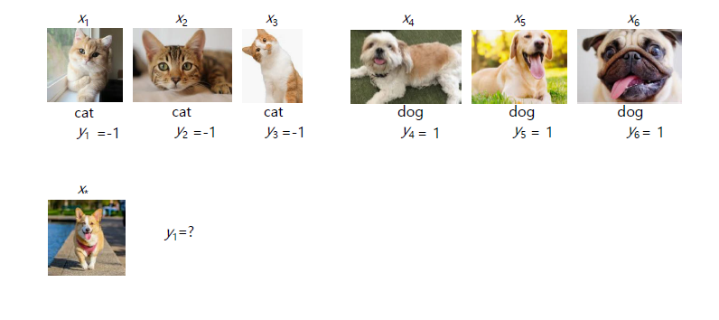
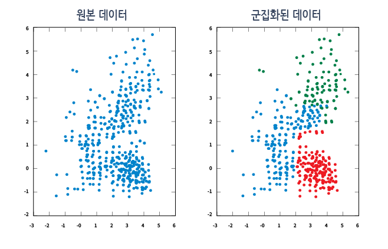
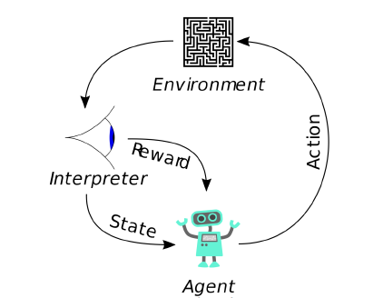

# 머신러닝(Machine Learning)

## 머신러닝이란 무엇인가?

다음에 올 숫자는 무엇일까?

간단하게 9라는 답들이 나왔을 것이다.이 간단한 추론 속에 3단계나 존재한다.

1. ``현상(숫자들의 변화)``을 관찰한다.

2. 관찰한 현상의 규칙을 통해 ``모델(예상 가능한 규칙)``을 만든다.

3. 다음에 일어날 현상(다음에 올 숫자)을 ``예측``한다.

이와 같은 학습을 프로그래밍을 통해 학습시키는 것을 머신러닝(Machine Learning)이라고 한다.

머신러닝은 자료(data)를 기반으로 하는 학습한다. 이 자료를 잘 가공하고 그에 맞는 모델을 만들기 위해서는 여러가지 지식이 필요하다.

* 수학적 지식(통계, 선형대수, 미적분 등)
* 최적화
* 프로그래밍 지식

## 머신러닝의 필요성

머신러닝의 필요성은 광범위한 분야에서 필요로 하고 있다. 아래의 내용은 필요성이 인식되는 분야의 일부를 나열한 것이다.

1. 글 인식(Text)

        스팸 필터링
        글 분류(분야별 뉴스 정리)
        검색 엔진 알고리즘
        에세이 마킹(오타 및 출처)
        소셜 미디어 모니터링(트렌드 파악)

2. 의학촬영과 진단

        의학촬영기법의 향상
        질병 진단
        발병 위험성 진단
        임상 실험 예측(피험자가 필요없는 예측 모델링)

3. 인간-컴퓨터 상호작용 (Human-Computer Interaction)

        핸드 제스처(Hand Gesture) 인식
        손글씨 및 음성 인식
        개인 비서 서비스(Siri, Bixby)
        추천 시스템(사용자 니즈(needs) 파악)
        자동 디자인 시스템

4. 사람

        맞춤형 광고 서비스
        투표예측
        재무 법의학(법의학 회계)
        계약 관리 및 분석
        테러예측(공항 내 의심물질 파악)

5. 금융

        금융사기 적발
        금융상품 제작
        트레이딩 봇

6. 로보틱스

        인간화 로봇
        자율주행 자동차
        프로그램 게이머(Deep Mind의 Alpha Go)

## 머신러닝의 과정

머신러닝의 과정은 우리가 시작할 때 봤던 수학적 추론의 과정과 유사하게 진행이 된다.

0. 문제가 주어진다.(혹은, 해결해야 문제를 선택한다)

1. 필요한 정보(데이터)를 모은다. (Training Data)

2. 필요한 정보나 결과에 맞추어 모델을 선택하거나 만든다.

3. 모델을 최적화 알고리즘을 이용하여서 데이터를 이용한 추론에 적당하도록 맞춘다.

4. 새로운 데이터를 이용해서 모델의 정확성을 확인한다. (Testing Data)

## 머신러닝의 방법

머신러닝의 방법은 크게 `지도학습`과 `비지도학습` 그리고 `강화 학습`으로 나눌 수 있다.

### A. 지도학습(Supervised Learning)

지도학습은 정답을 알려준 뒤에 학습시키는 방법이다.

위에 사진에서 볼 수 있듯이, 고양이 사진과 강아지 사진(input data - trainng data)에 따른 정답지(label data)를 알려준 뒤에

다른 사진(new data - testing data)을 맞추도록 지도하는 방법이다.

          분류(Classification) - 데이터의 결과값이 이산적일 경우
          회귀(Regression) - 데이터의 결과값이 연속적일 경우
          랭킹(Ranking) - 데이터의 결과값이 비교가능한 상태일 경우

### B. 비지도학습(Unsupervised Learning)

비지도학습은 정답지를 주지 않고 직접 문제를 분류하게 하는 방법이다.

여러 문제들을 학습하면서 직접 데이터의 패턴, 특성 및 구조를 스스로 파악하여, 이를 통해 새로운 데이터의 특징을 파악하는 방법이다.

지도학습처럼 사전지식이 주어지지 않지만, 직접 파악할 수 없는 숨겨진 특성이나 구조 등을 파악할 수 있다는 장점이 있습니다.

          군집화(Clustering)
                - 데이터간의 거리를 이용하여 특정 그룹으로 묶는 방법
          확률밀도추정(Density Estimation)
                - 주어진 데이터를 이용하여 만든 확률분포로 추정하는 방법

### C. 강화학습(Reinforce Learning)

상과 벌이라는 보상(Reward)을 주며 상을 최대화하고, 벌의 최소화하도록 강화 학습하는 방식
