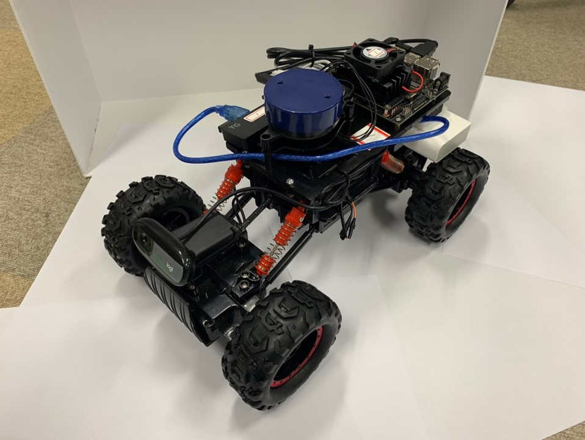
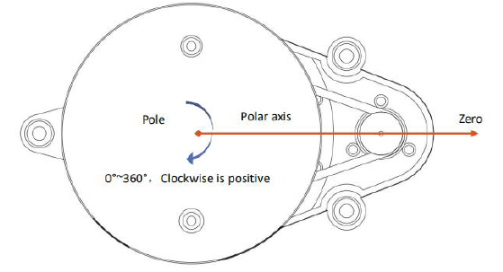

# RACECAR 장비 소개

## RACECAR

### RACECAR ROS 노드 개요

### RACECAR 부품 및 기능

### RACECAR 센서 리스트

* 카메라 - simple_camera.py 노드

이미지 파일을 bgr 타입으로 발행(publish)함
'rviz'명령어를 통해서 카메라 영상을 볼 수 있음.

* ydlidar-X2 - lidar_node.cpp 노드

LIDAR 정보를 발행(publish)함
LIDAR 정보 'Rviz'로 확인하는 방법

      $ roslaunch ydlidar ydlidar_view.launch

LIDAR 정보 확인방법

      $ roslaunch ydlidar lidar.launch
      $ rosrun ydlidar ydlidar_client

* Arduino - Arduino_drive.ino 노드
* Jetson Nano - driveNode.py / cmd_vel_mux.py / gamepad.py / joy_node.py 노드

### RACECAR 초기 설정법

1. 하단에 건전지 삽입 후, 스위치를 'on'으로 변경한다.

2. 라이다 케이블을 연결한다.

3. 전원 케이블을 연결한다.

4. 공유기 설정값을 맞춘다.

ssh -Xll racecar@192.168.0.'car-number'
