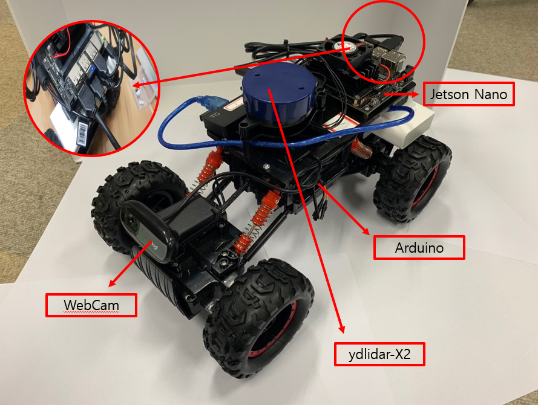
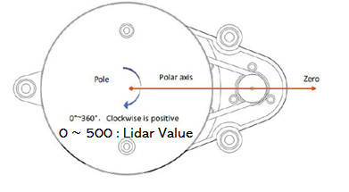

# RACECAR를 위한 기초 개념

## RACECAR ROS 노드 개요

## RACECAR 부품 및 기능

## RACECAR 센서 리스트

* 카메라 - simple_camera.py 노드

이미지 파일을 bgr 타입으로 발행(publish)함
'rviz'명령어를 통해서 카메라 영상을 볼 수 있음.

* ydlidar-X2 - lidar_node.cpp 노드

LIDAR 정보를 발행(publish)함
LIDAR 정보 'Rviz'로 확인하는 방법

      $ roslaunch ydlidar ydlidar_view.launch

LIDAR 정보 확인방법

      $ roslaunch ydlidar lidar.launch
      $ rosrun ydlidar ydlidar_client

* Arduino - Arduino_drive.ino 노드
* Jetson Nano - driveNode.py / cmd_vel_mux.py / gamepad.py / joy_node.py 노드

## RACECAR 사용법

1.하단에 건전지 삽입 후, 스위치를 'on'으로 변경한다.

2.Lidar 케이블을 연결한다.

3.전원 케이블을 연결한다.

4.노트북을 열어 racecar-RACECAR_NUMBER 공유기에 접속한다.

5.WSL을 열어 ssh를 실행한다

ssh -X racecar@192.168.0. RACECAR_NUMBER
