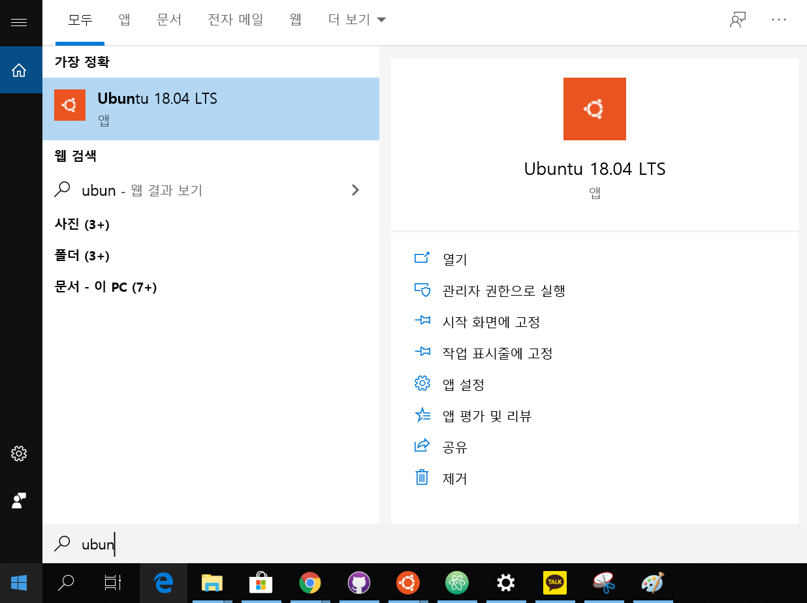

# WSL 설치 가이드

## Linux용 Windows 하위 시스템 설치

1.PowerShell을 '관리자 권한으로 실행'하여서 Linux용 Windows 하위 시스템 기능을 사용한다.

      Enable-WindowsOptionalFeature -Online -FeatureName Microsoft-Windows-Subsystem-Linux

2.메세지가 표시되면 컴퓨터를 다시 시작한다.

## 선택한 Linux 배포 설치

* Microsoft Store에서 다운로드 및 설치

1.Microsoft Store를 열고 즐겨찾는 Linux 배포를 선택합니다.

<https://www.microsoft.com/ko-kr/p/ubuntu-1804-lts/9n9tngvndl3q?rtc=1&SilentAuth=1&wa=wsignin1.0&activetab=pivot:overviewtab>

2.배포판의 페이지에서 "가져오기"를 선택합니다.

3.설치완료 후 실행해서 초기 설정을 실행합니다.

4.실행한 이후 ID와 비밀번호를 설정한다. Windows와 개별적으로 존재하므로 본인의 편의상 작성하면 된다.

