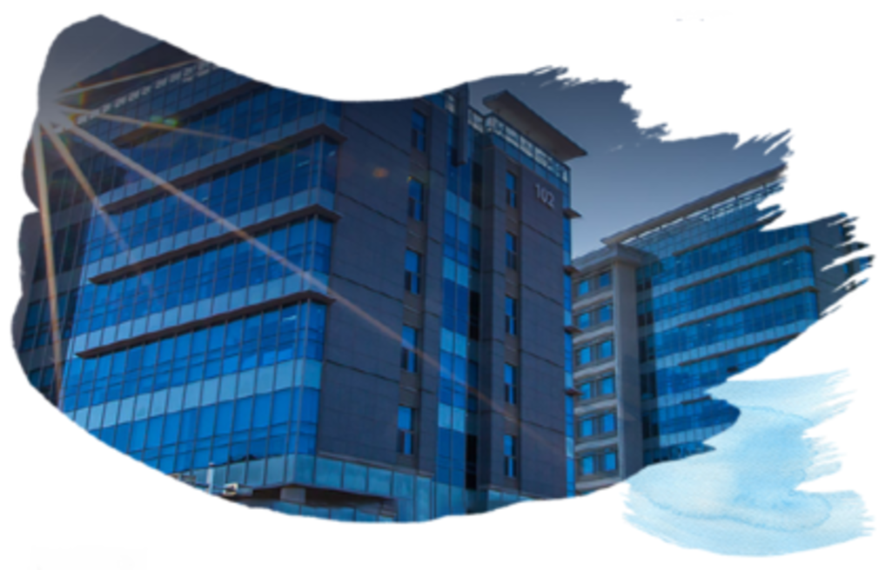
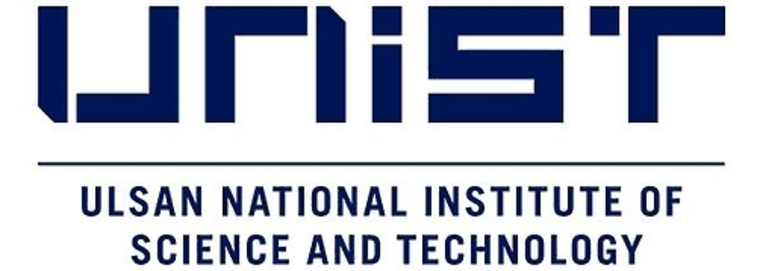
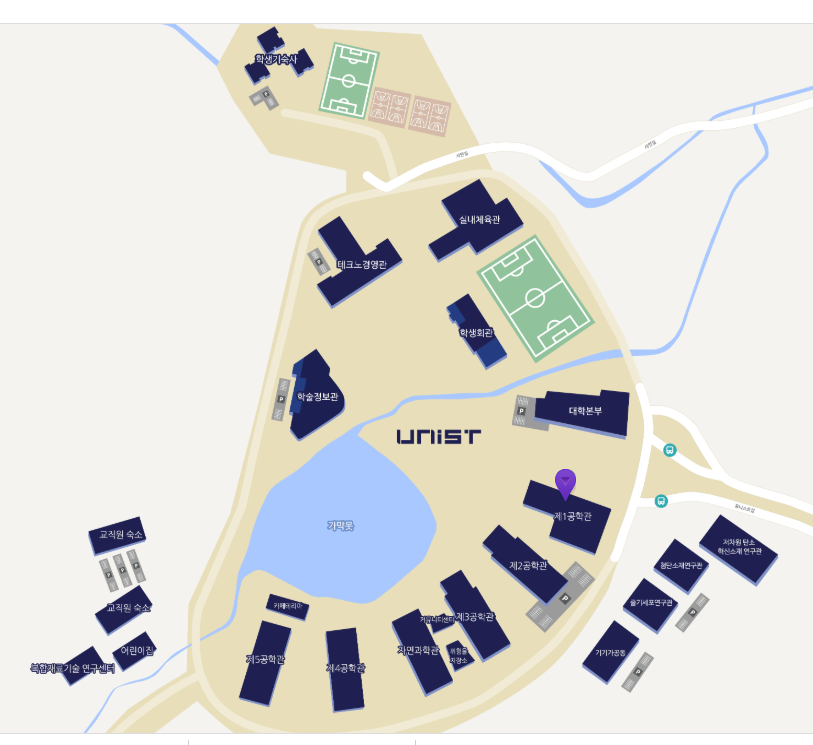
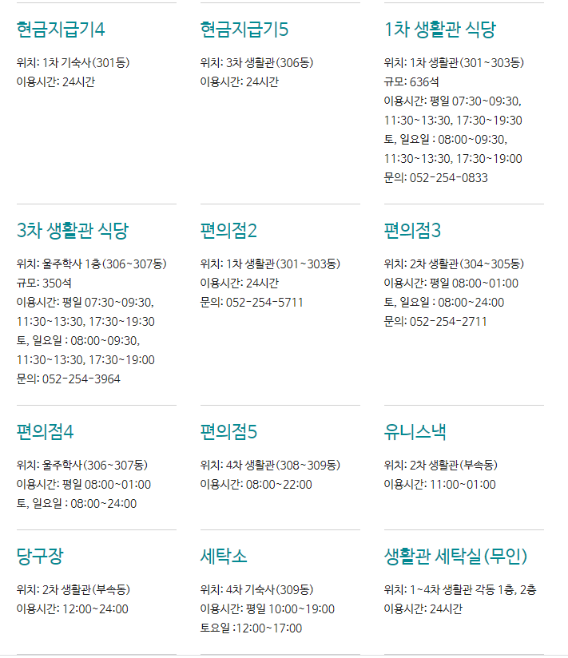

# Welcome to UNIST STEM-CAMP

## 캠프 일정표

## 캠퍼스 약도

## 편의시설 안내

## 긴급 연락망

| 프로그램 관리자 | 연락처 |
|----------------|-------|
| 교수 문영제 | yjmoon@unist.ac.kr |
| 리더십센터 신현배 | 010-9364-8044 |
| 리더십센터 김세은 | 010-3920-3060 |
| 리더십센터 오창주 | 010-5524-8190 |
| 헬스케어센터 |  052-217-4011(상담), 4012(보건) |
| TA 신정하(생활멘토) | 010-3411-8547 |
| TA 김중빈(생활멘토) | 010-4198-7256 |
| TA 김태윤 | 010-5279-1628 |
| TA 이현빈 | 010-3009-2915 |
| TA 임가은 | 010-5055-2279 |
| TA 임수철 | 010-4640-0176 |
